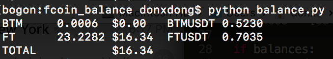
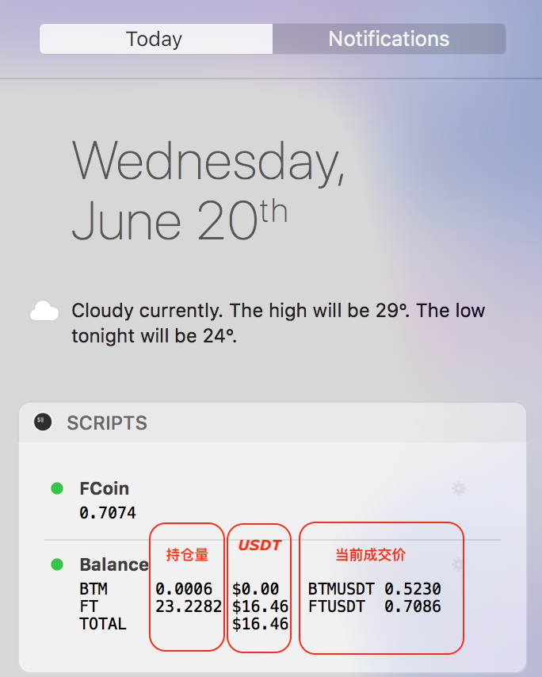

Fcoin 交易所api forked from weiliuv/fcoin-python-sdk

### ⚠️你自己的 key 和 secret，不要泄露出去，本程序不对你的财产安全负任何责任⚠️

#### Clone 项目后请修改 balance.py 将你自己的 key 和 secret 填进去
```
python /your/path/to/balance.py
```

#### 根据资产情况和当前交易价格，全部换算为USDT进行输出：



#### 添加到 macOS Today 系统请安装：https://github.com/megabitsenmzq/Today-Scripts

